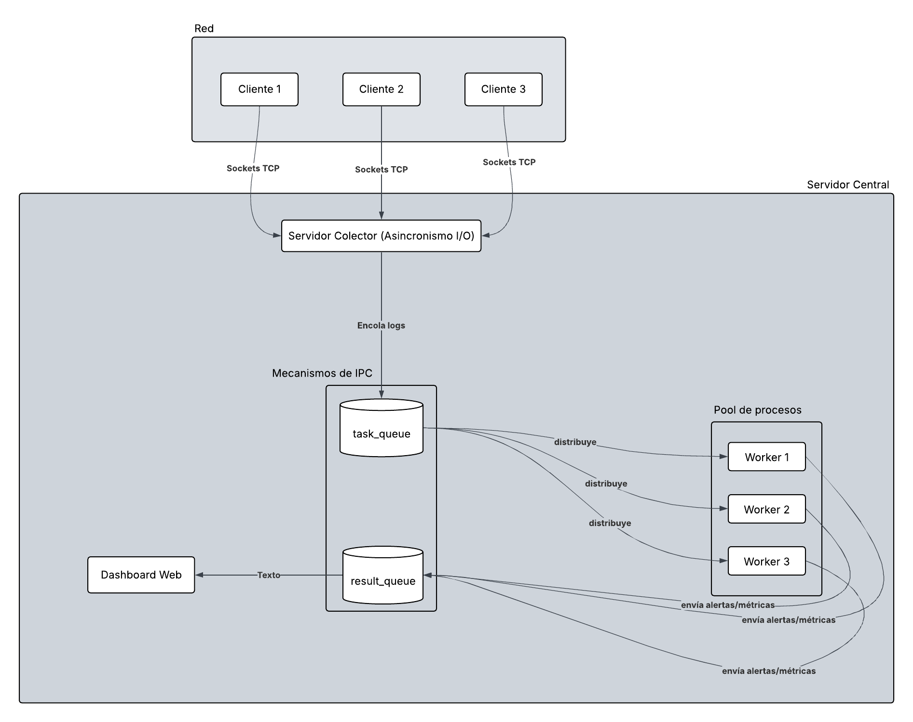

# Propuesta de Proyecto: Sistema Distribuido de Análisis de Seguridad (SDAS)

**Alumno:** Torres Burgos María Victoria \
**Legajo:** 62092

## Descripción de la Aplicación

El proyecto consiste en un sistema de detección de intrusiones (IDS) basado en una arquitectura **Cliente-Servidor** distribuida, diseñada para procesar logs de sistema y alertar sobre posibles amenazas en tiempo real.

* **Origen de los Datos:** El sistema utiliza archivos de log locales como fuente de datos. Estos archivos simulan la actividad de un servidor real.
* **Clientes (Agentes):** Son procesos livianos que realizan un **streaming** del archivo (lectura línea por línea en tiempo real). Envían cada línea a través de **Sockets TCP** hacia un nodo central. Se utiliza **concurrencia** para gestionar la lectura del archivo y la comunicación de red simultáneamente.
* **Servidor Colector:** Es el núcleo del sistema. Utiliza **Asincronismo de I/O** (mediante la librería `asyncio`) para recibir logs de múltiples clientes a la vez sin necesidad de crear un hilo por conexión, optimizando el uso de recursos.
* **Procesamiento Paralelo (Workers):** El servidor coloca los logs en una **Cola de Tareas (task_queue)**. Un pool de procesos independientes (**multiprocessing**) consume de esta cola. Cada Worker analiza las líneas usando expresiones regulares (Regex) para detectar patrones de ataque.
* **Comunicación de Resultados:** Las detecciones se envían a través de una **Cola de Resultados (result_queue)** hacia el proceso del **Dashboard Web**, que consume estos datos de manera asincrónica para actualizar la interfaz.

## Arquitectura de la aplicación

    

## Funcionalidades por Entidad

| Entidad | Acción Principal | Tecnología / Mecanismo |
| --- | --- | --- |
| **Cliente** | Monitorea un archivo de log local y envía cada línea nueva al servidor. | • Sockets TCP • Streaming de archivos (`tail -f`) |
 **Servidor Colector** | Escucha a múltiples clientes a la vez y pone los datos en fila para ser analizados. | • Asincronismo de I/O (`asyncio`) • Cola de Tareas (`task_queue`) |
| **Worker** | Escanea el texto buscando patrones maliciosos y decide la gravedad del ataque. | • Multiprocesamiento (Paralelismo) • Expresiones Regulares (Regex) |
| **Dashboard** | Muestra las alertas en tiempo real y genera gráficos de estadísticas. | • Cola de Resultados (`result_queue`) • Interfaz Gráfica (Web/CLI) |
